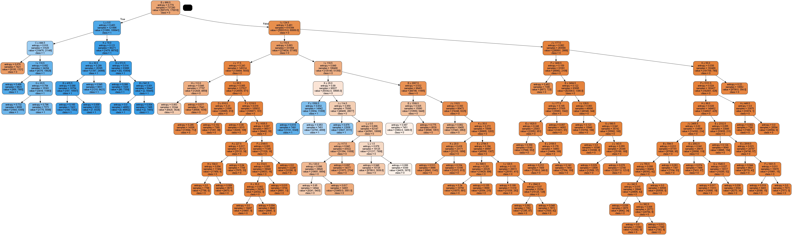
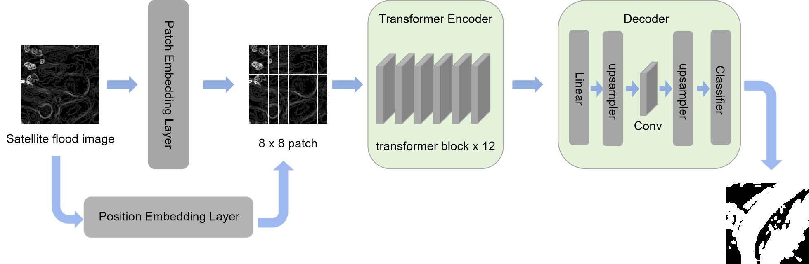

# FloodSegProject

使用了多种方法来解决洪水卫星图像分割任务的仓库

## 网络框架图集

### 1. Random Forest 框架

### 2. Transformer 框架

### 1. Random Forest 框架

### 2. 项目背景
本项目旨在通过多种深度学习和机器学习方法实现洪水卫星图像的精准分割。

### 3. 支持的方法
- 随机森林
- U-Net
- Transformer

### 4. 目录结构
